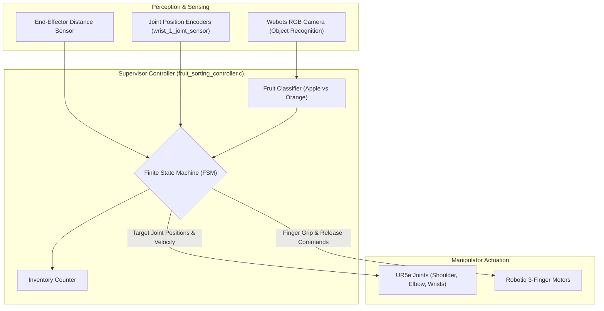
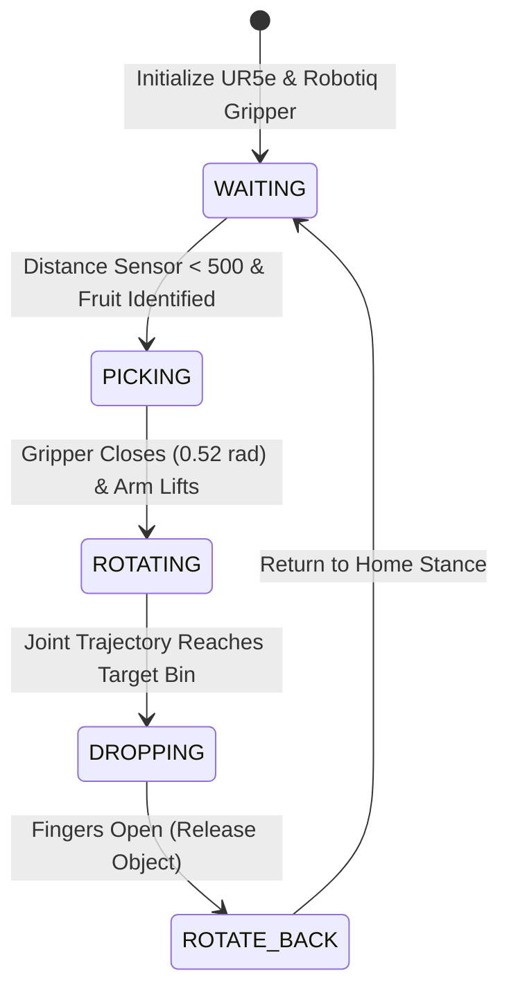

# Industrial Robotic Arm: Vision-Guided Fruit Sorting System (Webots)

An automated industrial sorting cell simulation developed in **Webots**. The system integrates a **Universal Robots UR5e** 6-DOF robotic manipulator equipped with a **Robotiq 3-Finger Adaptive Robot Gripper**, an optical recognition camera, and an end-effector distance sensor to classify, pick, and sort fruits (apples and oranges) arriving along a rail/conveyor into designated sorting receptacles.

---

## Table of Contents

- [Features](#features)
- [System Architecture](#system-architecture)
- [Finite State Machine (FSM) Workflow](#finite-state-machine-fsm-workflow)
- [Hardware Specification (Simulated)](#hardware-specification-simulated)
- [Project Structure](#project-structure)
- [Installation & Running the Simulation](#installation--running-the-simulation)
- [Media & Demonstration](#media--demonstration)
- [Author](#author)

---

## Features

- **Automated Visual Classification**:
  - Webots Camera module with built-in object recognition identifying passing fruit models (apples vs. oranges) based on optical features and model metadata.
- **Proximity-Gated Grasp Verification**:
  - End-effector distance sensor detects when an object enters the optimal grasping volume ($< 500\text{ mm}$), ensuring reliable contact before closing gripper fingers.
- **Adaptive 3-Finger Gripper Control**:
  - Independent positional actuation of three robotic fingers (`finger_1_joint_1`, `finger_2_joint_1`, `finger_middle_joint_1`) providing compliant grasps for spherical objects.
- **Deterministic Finite State Machine (FSM)**:
  - 5-stage closed-loop trajectory cycle: `WAITING` $\rightarrow$ `PICKING` $\rightarrow$ `ROTATING` $\rightarrow$ `DROPPING` $\rightarrow$ `ROTATE_BACK`.
- **Bin-Specific Trajectory Routing**:
  - Separate kinematics trajectory target arrays routing apples and oranges to distinct drop zones.
- **Real-Time Item Accounting**:
  - Continuous runtime counting and tracking of sorted inventory.

---

## System Architecture



---

## Finite State Machine (FSM) Workflow



---

## Hardware Specification (Simulated)

| Subsystem | Model / Component | Configuration / Joint Names |
|---|---|---|
| Manipulator | Universal Robots UR5e | `shoulder_pan_joint`, `shoulder_lift_joint`, `elbow_joint`, `wrist_1_joint`, `wrist_2_joint` |
| End-Effector | Robotiq 3-Finger Adaptive Gripper | `finger_1_joint_1`, `finger_2_joint_1`, `finger_middle_joint_1` |
| Vision Sensor | Webots Camera | Resolution enabled at $2 \times \text{TIME\_STEP}$ with Object Recognition |
| Proximity Sensor | Distance Sensor | Infrared proximity sensor positioned at gripper center |
| Environment | Conveyor Rail / Sorting Bins | Custom 3D mesh assets in `project/worlds/obj/rail` |

---

## Project Structure

```text
Industrial-Robotic-Arm/
├── project/
│   ├── controllers/
│   │   ├── fruit_sorting_controller/
│   │   │   ├── fruit_sorting_controller.c  # Core FSM sorting controller in C
│   │   │   └── Makefile                    # Webots C controller build script
│   │   └── fruit_ctrl/
│   │       ├── fruit_ctrl.c                # Secondary fruit manipulation controller
│   │       └── Makefile                    # Webots build script
│   └── worlds/
│       ├── Universal Robot.wbt             # Webots world definition with UR5e & conveyor
│       └── obj/rail/                       # 3D Wavefront OBJ models and materials for rail
├── Robotics Prest.pptx                     # Project presentation deck
├── Vedio.mp4                               # Video demonstration of the operational simulation
└── README.md
```

---

## Installation & Running the Simulation

### Prerequisites
- [Cyberbotics Webots](https://cyberbotics.com/) (version R2022b or later recommended)
- Standard C compiler toolchain (GCC / MinGW on Windows, or Clang/GCC on Linux)

### Execution Steps

1. Launch Webots.
2. Select **File** $\rightarrow$ **Open World...** and navigate to:
   ```text
   Industrial-Robotic-Arm/project/worlds/Universal Robot.wbt
   ```
3. To rebuild the C controllers within Webots:
   - Open the controller file `project/controllers/fruit_sorting_controller/fruit_sorting_controller.c` in Webots' internal text editor.
   - Click the **Build** icon (or run `make` inside the controller directory).
4. Press the **Play** button on the Webots simulation control toolbar to run the fruit sorting cell.

---

## Media & Demonstration

- A full simulation run demonstrating vision recognition, automated gripping, and bin sorting is available in [`Vedio.mp4`](Vedio.mp4).
- Architectural slides and design breakdown are documented in [`Robotics Prest.pptx`](Robotics%20Prest.pptx).

---

## Author

- **Mohamed Ghanem** - [Eng-Ghanem](https://github.com/Eng-Ghanem)
